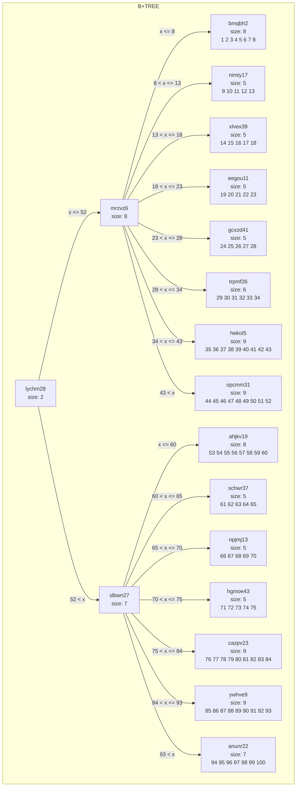

```mermaid
graph TD
subgraph B+TREE
lychm28[lychm28<br/>size: 2<br/>]
mrzvz6[mrzvz6<br/>size: 8<br/>]
bmqbh2[bmqbh2<br/>size: 8<br/>1 2 3 4 5 6 7 8 ]
mrzvz6-->|x <= 8|bmqbh2
nimty17[nimty17<br/>size: 5<br/>9 10 11 12 13 ]
mrzvz6-->|8 < x <= 13|nimty17
xlvex39[xlvex39<br/>size: 5<br/>14 15 16 17 18 ]
mrzvz6-->|13 < x <= 18|xlvex39
eegou11[eegou11<br/>size: 5<br/>19 20 21 22 23 ]
mrzvz6-->|18 < x <= 23|eegou11
gcxzd41[gcxzd41<br/>size: 5<br/>24 25 26 27 28 ]
mrzvz6-->|23 < x <= 28|gcxzd41
trpmf26[trpmf26<br/>size: 6<br/>29 30 31 32 33 34 ]
mrzvz6-->|28 < x <= 34|trpmf26
hekot5[hekot5<br/>size: 9<br/>35 36 37 38 39 40 41 42 43 ]
mrzvz6-->|34 < x <= 43|hekot5
opcmm31[opcmm31<br/>size: 9<br/>44 45 46 47 48 49 50 51 52 ]
mrzvz6-->|43 < x|opcmm31
lychm28-->|x <= 52|mrzvz6
slbwn27[slbwn27<br/>size: 7<br/>]
ahjkv19[ahjkv19<br/>size: 8<br/>53 54 55 56 57 58 59 60 ]
slbwn27-->|x <= 60|ahjkv19
schwr37[schwr37<br/>size: 5<br/>61 62 63 64 65 ]
slbwn27-->|60 < x <= 65|schwr37
npjmj13[npjmj13<br/>size: 5<br/>66 67 68 69 70 ]
slbwn27-->|65 < x <= 70|npjmj13
hgmoe43[hgmoe43<br/>size: 5<br/>71 72 73 74 75 ]
slbwn27-->|70 < x <= 75|hgmoe43
cazpv23[cazpv23<br/>size: 9<br/>76 77 78 79 80 81 82 83 84 ]
slbwn27-->|75 < x <= 84|cazpv23
ywhve9[ywhve9<br/>size: 9<br/>85 86 87 88 89 90 91 92 93 ]
slbwn27-->|84 < x <= 93|ywhve9
anunr22[anunr22<br/>size: 7<br/>94 95 96 97 98 99 100 ]
slbwn27-->|93 < x|anunr22
lychm28-->|52 < x|slbwn27
end
```

```mermaid
graph LR
subgraph UNORDERED_HEAP
nwlrb1[nwlrb1<br/>size: 4<br/>73 32 14 84 ]
jtvil3[jtvil3<br/>size: 4<br/>34 9 27 90 ]
nwlrb1-->jtvil3
skamn4[skamn4<br/>size: 4<br/>65 98 95 85 ]
jtvil3-->skamn4
pmzte7[pmzte7<br/>size: 4<br/>11 18 96 80 ]
skamn4-->pmzte7
hiklm8[hiklm8<br/>size: 4<br/>31 63 93 97 ]
pmzte7-->hiklm8
unqvb10[unqvb10<br/>size: 4<br/>37 29 6 41 ]
hiklm8-->unqvb10
zcnyx12[zcnyx12<br/>size: 4<br/>59 79 7 72 ]
unqvb10-->zcnyx12
ptrag14[ptrag14<br/>size: 4<br/>16 88 26 35 ]
zcnyx12-->ptrag14
fafpw15[fafpw15<br/>size: 4<br/>2 70 77 53 ]
ptrag14-->fafpw15
jjlcg16[jjlcg16<br/>size: 4<br/>52 92 5 8 ]
fafpw15-->jjlcg16
gubuu18[gubuu18<br/>size: 4<br/>33 47 28 58 ]
jjlcg16-->gubuu18
ubqob20[ubqob20<br/>size: 4<br/>42 64 1 66 ]
gubuu18-->ubqob20
xteck21[xteck21<br/>size: 4<br/>100 78 75 87 ]
ubqob20-->xteck21
avrbr24[avrbr24<br/>size: 4<br/>19 69 67 12 ]
xteck21-->avrbr24
lbyxn25[lbyxn25<br/>size: 4<br/>51 20 61 60 ]
avrbr24-->lbyxn25
wkoxz29[wkoxz29<br/>size: 4<br/>43 30 17 46 ]
lbyxn25-->wkoxz29
mxwdy30[mxwdy30<br/>size: 4<br/>49 62 68 71 ]
wkoxz29-->mxwdy30
pifgw32[pifgw32<br/>size: 4<br/>94 22 15 44 ]
mxwdy30-->pifgw32
lzhmx33[lzhmx33<br/>size: 4<br/>36 24 45 86 ]
pifgw32-->lzhmx33
wzyyh34[wzyyh34<br/>size: 4<br/>48 83 82 3 ]
lzhmx33-->wzyyh34
kwrau35[kwrau35<br/>size: 4<br/>25 40 81 4 ]
wzyyh34-->kwrau35
smtoq36[smtoq36<br/>size: 4<br/>54 99 38 13 ]
kwrau35-->smtoq36
tlbyu38[tlbyu38<br/>size: 4<br/>89 39 57 10 ]
smtoq36-->tlbyu38
sazqa40[sazqa40<br/>size: 4<br/>23 50 21 56 ]
tlbyu38-->sazqa40
trrmh42[trrmh42<br/>size: 4<br/>91 74 76 55 ]
sazqa40-->trrmh42
end
```
